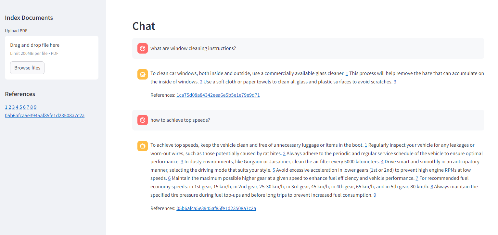

## submission car RAG

### Notes and submission outline  
My focus of this attempt was to build a structured and maintainable solution to the RAG problem. I have included multiple configurations, that can be changed with env files. 

As a first step I wrote the barebones of the project. Where basic db operations, indexer, and retriever are present. Then, I connected all the components to work end to end. 

In the third step, I integrated this with front-end. The final step (there may be a few final steps) would be to improve quality of the answers, handling edge cases, making user experience better. 

The submission is a just-working PoC. Nowhere near `staging` level. 

A few considerations for further quality improvement are as follows: 

1. Prompt improvements \
    a. Include a verbose and non-verbose output. \
    b. Where clause building -- robust testing, parsable query, reflection \
    c. Reflection on the answer for factual check \
        - This step is currently ensured by including references and grounding the llm using prompts. But, an additional step will make sure the outcome user sees is according to policy etc. 
2. Indexing system improvements \
    a. Sentence level indexing \
        - May not be ideal for the current use case. \
        - If the input is information dense, and multiple topics are present then we may want to do this. \
    b. KG indexing \
        - Building a knowledge graph using GraphRAG may be a good option \
        - This solution is useful in maintaining information freshness, relations (if we are talking about multiple entities etc.) \
        - Current use case _may_ benefit from a KG as an additional index. \
    c. Hierarchical index \
        - The documents we are working with have hierarchy, in terms of sections etc.. \
        - We may consider indexing them at section level, and at retrieval time we can do multiple ANN calls at each level \
        - Advantage would be a more focused outcome, works well if we are dealing with massive amount of data with 100s of car models. 
3. Retrieval system improvements \
    a. Agentic. _might be far fetched_ for the current use case. \
        - My personal take on agentic is *either we write retriever, indexer separately or use agents to write less code make more llm calls :D * \
        - 
    b. Using multiple llms \
        - Eg: to check if a question is answerable a Gemma would be enough, for writing the WHERE clause Anthropic maybe a good candidate, and to write answer openai is well suited.

### components 
1. indexing job 
    - ~~parse pdfs~~
    - ~~identify tables and images ~~
    - embed text \
        ~~[ ] openai and hugging face embeddings ~~
        [ ] custom logic to embed tables and images
    - store in db \
        ~~[ ] run time db -- lancedb~~ \
        [ ] persistant db like mongo. 
2. retrieval job 
    - ~~check if question is answerable ~~
    - ~~get question embeddings~~  \
    [ ] get keywords
    - ~~build query ~~
    - ~~do vector search~~ \
    [ ] do keyword search \
    [ ] reranking of results
    - ~~answer question~~
